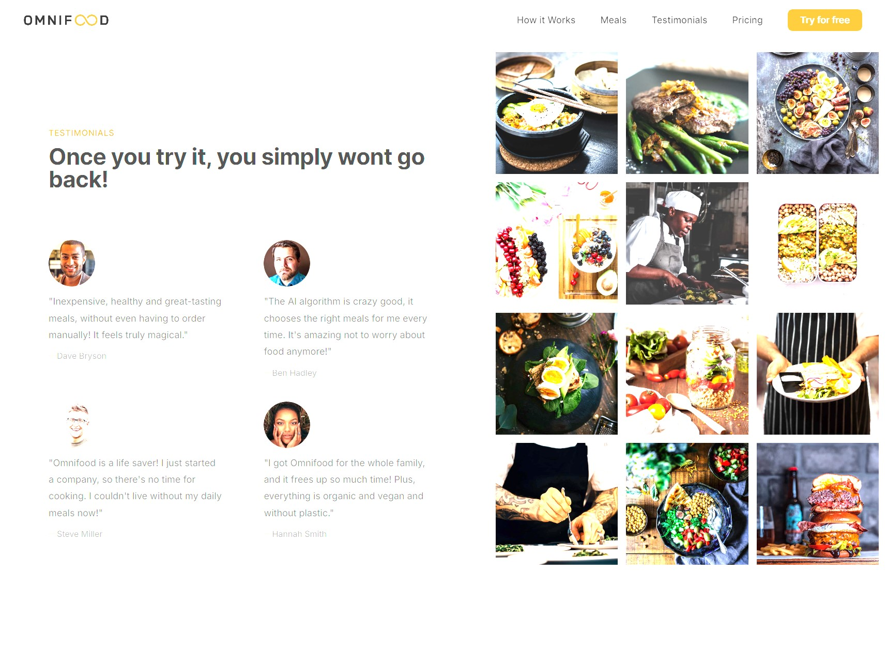

Live site hosted through Netlify:
https://omnifoodhg.netlify.app

DEFINE PROJECT
1. For Omnifood Company
WHAT for
2. Business goal: to sell monthly food sub
3. User goal: Eating healthy, time saver, cost effective
TARGET audience
4. Busy people who like tech, health conscious,hard working well-paid market of people

PLAN ORGANIZE CONTENT
 1. text and images provided by Client

PLAN SITE MAP
0. not needed due to this being a one page site or a "landing page"

DEFINE Personality
1. Tech Health centered audience
2. Startup and upbeat personalities 

SCREENSHOTS:::

